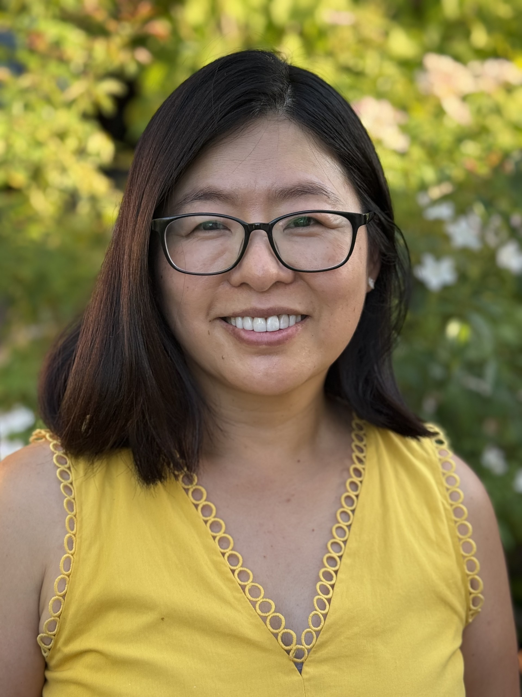

About Me | Joyfully Present Life Coaching

  
    
      
      Joyfully PresentLife Coaching
    
    &#9776;
    
    

      - [Home](index.html)

      - [About Me](about.html)

      - [Services](services.html)

      - [FAQ](faq.html)

    

    
      [My Appointments](my-appointments.html)
      [Book a Session](book.html)
    
    
  

  
    
      About Me
      
# Hi, I'm Mei.

      
I help busy professionals and parents who feel stressed, anxious, and overwhelmed cultivate lasting calm, confidence, and joy so they can thrive at home, excel at work, and be fully present for what matters most.

    
  

 
    
      
      
      
        
          
        
        
          
## My story

          
For over 40 years, I believed anxiety was simply part of who I was. Although I had a successful career and a wonderful family, I often felt anxious, burned out, and overwhelmed. Everything changed when I discovered meditation. Combined with mindfulness and positive psychology practices, these simple, evidence-based tools transformed how I responded to stress and anxiety. I became calmer, more resilient, and more present—and my life changed in ways I never imagined.

          
Now, as a certified life coach specializing in stress and anxiety, I help others create the same transformation. With practical skills that take just minutes a day, you can reduce stress, build confidence, and experience greater calm and joy.

          
If you're ready to stop just getting through the day and start truly thriving, I'd love to help you on your journey.

        
      

      
      
        
## How I work

        

          - Certified Mindfulness Life Coach specializing in stress, burnout, anxiety, and mindfulness.

          - 20+ years as a high school educator. For the past four years, I've taught these same evidence-based skills to students, many of whom have shared how transformative they've been for their well-being.

          - Practical, sustainable tools that fit into your daily life and take just minutes a day to practice.

          - A personalized, skills-based coaching approach that helps you build lasting calm, confidence, resilience, and joy.

          - I believe everyone can learn the skills to create a calmer, more joyful, and more present life.

        

        
          [See How We Can Work Together](services.html)
        
      

    
  

  
    
      
> "My work isn't to fix you. It's to help you learn skills so you can thrive."

      &mdash; Mei 
    
  

  
    
      
        
        Joyfully PresentLife Coaching
      
      

        - [Home](index.html)

        - [About Me](about.html)

        - [Services](services.html)

        - [FAQ](faq.html)

      

    
    
      &copy; 2026 Joyfully Present Life Coaching LLC &middot; 440 N Barranca Ave #9885, Covina, CA 91723
      
        [Terms](terms.html) &middot;
        [Privacy](privacy.html) &middot;
        [Status](https://status.joyfullypresent.life) &middot;
        hello@joyfullypresent.life
